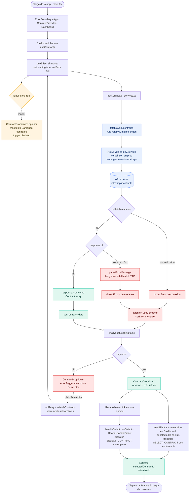
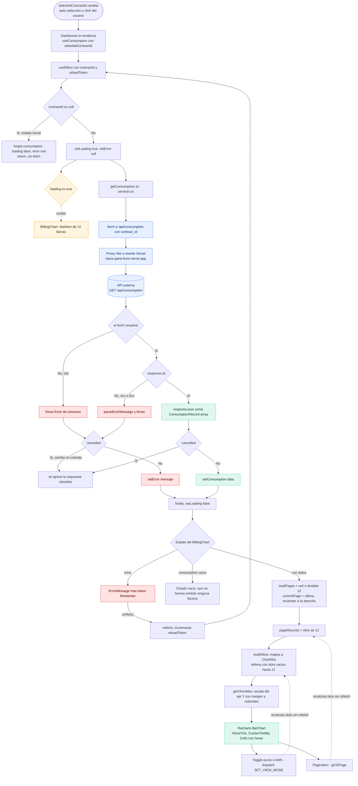
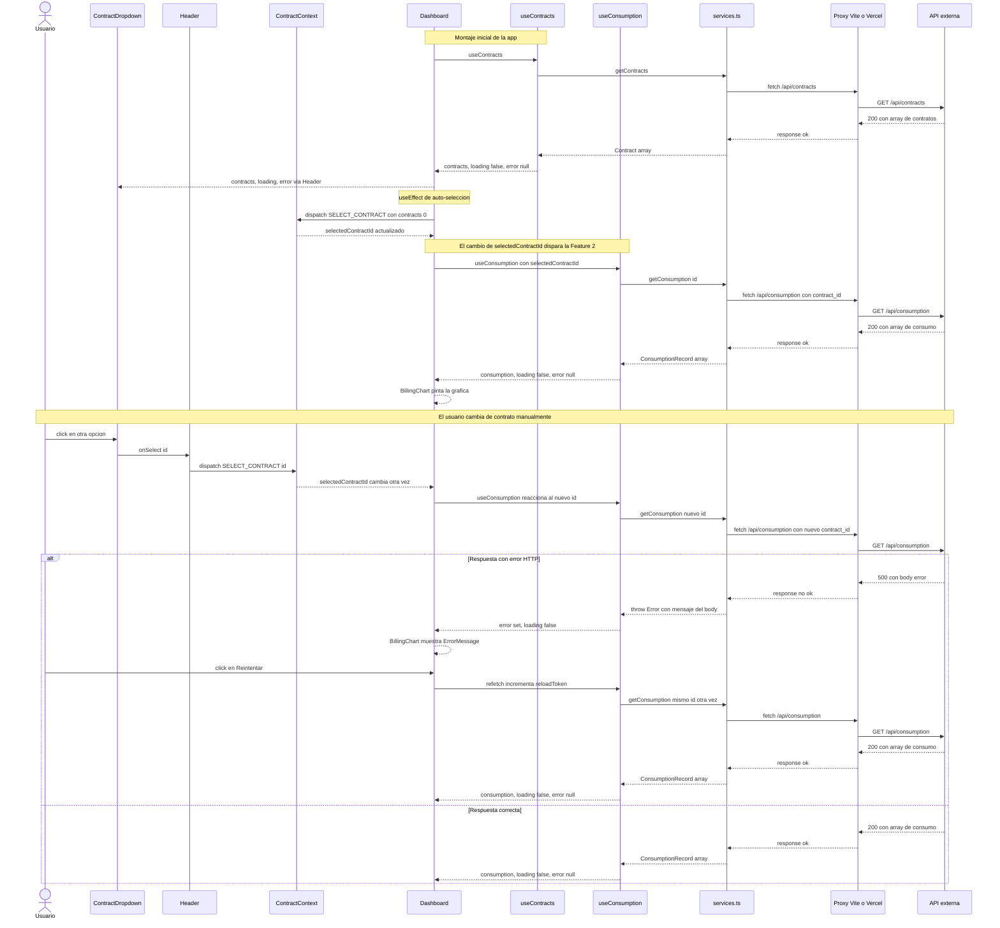

# Flujos de datos del dashboard

Representación visual esquemática de las dos funcionalidades principales del
proyecto. Cada diagrama recorre el dato desde que el usuario interactúa con la
UI hasta que se renderiza, incluyendo **todas las ramas posibles**: carga
(loading), éxito, error de red y error HTTP.

## Cómo leer los diagramas

| Forma / color | Significado |
|---------------|-------------|
| Rombo `◇` | Punto de decisión (bifurcación del flujo) |
| Cilindro | API externa (`gana-front.vercel.app`) |
| Naranja | Estado de carga (loading) |
| Rojo | Rama de error |
| Verde | Rama de éxito / datos disponibles |
| Azul | Capa de red (fetch + proxy) |
| Flecha punteada | Efecto secundario / render derivado (no continúa el flujo principal) |

Ideas transversales a los dos flujos:

- Las rutas del `fetch` son **relativas** (`/api/...`). Un **proxy** las reenvía
  a la API real (Vite en desarrollo, `vercel.json` en producción), evitando CORS.
- El **estado de servidor** (contratos, consumo) vive en los hooks; el **Context**
  solo guarda `selectedContractId` y `viewMode`. El `selectedContractId` es el
  pegamento entre ambas features: la Feature 1 lo escribe, la Feature 2 lo lee.
- El **reintento** es siempre el mismo mecanismo: `onRetry → refetch →
  reloadToken++ → se re-ejecuta el useEffect del hook`.
- El flag `cancelled` de la cláusula de limpieza descarta respuestas obsoletas
  (doble montaje de StrictMode y cambios rápidos de contrato).

---

## Feature 1 — Carga y selección de contratos

Desde el arranque de la app hasta que el `ContractDropdown` muestra los
contratos y el usuario (o la auto-selección) elige uno. El nodo final enlaza
con la Feature 2.

---

## Feature 2 — Carga del consumo del contrato seleccionado

Se dispara cuando `selectedContractId` cambia (por la auto-selección inicial o
por un clic del usuario). Termina en el render del `BillingChart`, con sus tres
estados (skeleton, error, vacío) y el procesamiento de los datos hacia la
gráfica. El toggle €/kWh y la paginación **no** vuelven a la red.

---

## Diagrama de secuencia — diálogo entre capas

Complementa a los dos flowcharts: mientras estos muestran las *ramas*
posibles, este diagrama muestra el *orden temporal* de las llamadas entre
componente, hook, servicio, proxy y API para una selección de contrato
completa (Feature 1 seguida de Feature 2), incluyendo una rama de error y un
reintento.

---

## Resumen del recorrido de un dato

1. **Arranque** → `useContracts` pide `/api/contracts` a través del proxy.
2. Los contratos llegan → se pintan en el `ContractDropdown` y la
   auto-selección elige el primero (`SELECT_CONTRACT`).
3. Ese cambio en el Context activa `useConsumption`, que pide
   `/api/consumption?contract_id=…`.
4. El consumo llega → `BillingChart` lo pagina de 12 en 12, rellena la última
   página incompleta y lo dibuja con Recharts.
5. El usuario puede **cambiar de contrato** (vuelve al paso 3), **cambiar la
   unidad** (€/kWh, recalcula sin red) o **paginar** (recalcula sin red).
